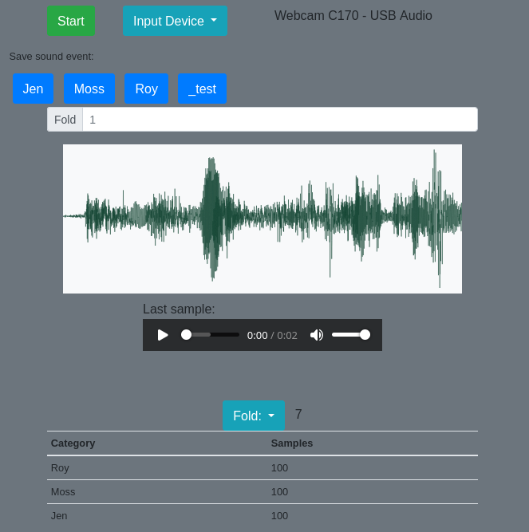

Tool for making small sound datasets. Once the recording backend starts, it can record fixed-length audio; and then update a data frame in CSV format. `ffmpeg` is being used as a recording backend



# Install
```bash
pip install -r requirements.txt
```

# Run
```bash
FLASK_FFMPEG_BIN=/usr/bin/ffmpeg python app.py
```
